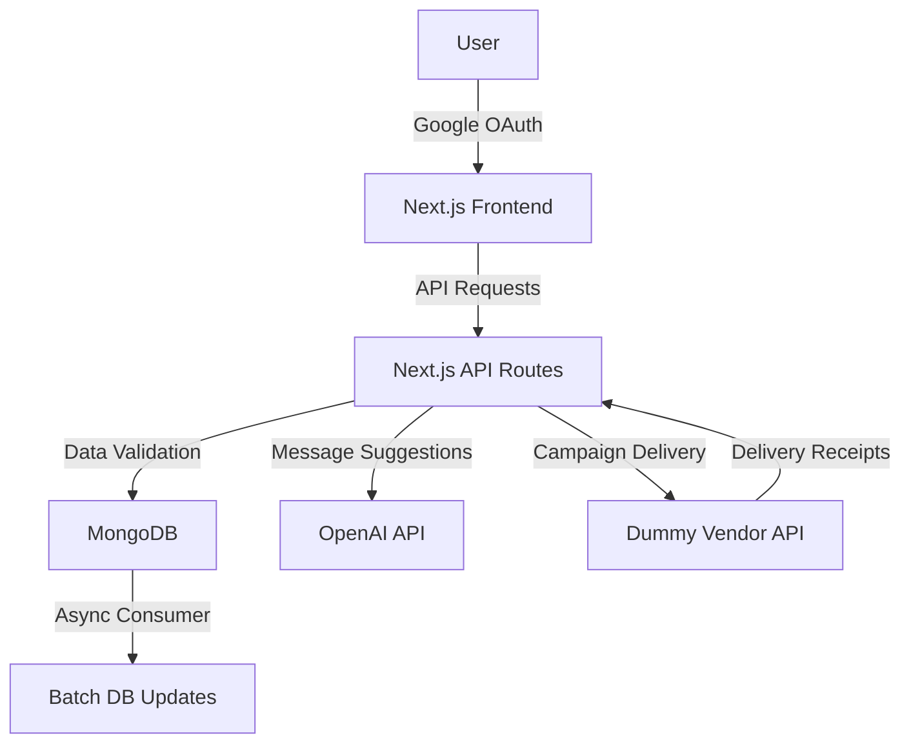

# Xeno
# Xeno SDE Internship Assignment – 2025: Mini CRM Platform

Welcome to my submission for the Xeno SDE Internship Assignment 2025! This project is a **Mini CRM Platform** built to enable customer segmentation, personalized campaign delivery, and intelligent insights using modern web technologies and AI integration. Below, you'll find a comprehensive overview of the project, setup instructions, architecture, and more.

## Project Overview

The Mini CRM Platform allows users to:
- **Ingest customer and order data** via secure REST APIs.
- **Create audience segments** with a dynamic rule builder (e.g., "spend > ₹10,000 AND visits < 3").
- **Manage and track campaigns** with delivery stats and personalized messaging.
- **Authenticate users** securely using Google OAuth 2.0.
- **Leverage AI** for generating message suggestions based on campaign objectives.

The project is built with a focus on clean code, scalability, and an intuitive user experience, incorporating a modern tech stack and AI-driven features.

## Features

- **Data Ingestion APIs**: Secure REST APIs for customer and order data, documented with Swagger UI.
- **Campaign Creation UI**: A Next.js-based web app with a dynamic rule builder for audience segmentation, campaign history, and real-time audience size preview.
- **Campaign Delivery & Logging**: Asynchronous campaign delivery with a dummy vendor API simulating ~90% success and ~10% failure rates, with batch updates to the database.
- **Authentication**: Google OAuth 2.0 integration using NextAuth.js for secure access.
- **AI Integration**: AI-driven message suggestions using an OpenAI API to generate personalized campaign messages based on objectives (e.g., "bring back inactive users").
- **Responsive UI**: Built with Tailwind CSS and Radix UI components for a clean, intuitive, and modern UX.

## Tech Stack

- **Frontend**: Next.js (React), Tailwind CSS, Radix UI, Lucide React (icons), React Hook Form, Embla Carousel, Recharts (charts)
- **Backend**: Node.js (Next.js API routes), Mongoose (MongoDB ORM)
- **Database**: MongoDB
- **Authentication**: NextAuth.js with Google OAuth 2.0
- **AI Tools**: OpenAI API for generating personalized message suggestions
- **Others**:
  - **Zod**: Schema validation for APIs and forms
  - **Sonner**: Toast notifications
  - **Class Variance Authority (CVA)**: Dynamic Tailwind CSS class management
  - **Swagger UI**: API documentation
  - **Vercel**: Deployment platform

## Architecture Diagram



**Explanation**:
- **Frontend**: Next.js handles the UI, including the rule builder, campaign history, and authentication flows.
- **Backend**: Next.js API routes process requests, validate data with Zod, and interact with MongoDB via Mongoose.
- **AI Integration**: OpenAI API generates message suggestions based on campaign objectives.
- **Campaign Delivery**: A dummy vendor API simulates message delivery, with receipts updating the communication log in batches.
- **Database**: MongoDB stores customer, order, and campaign data.

## Setup Instructions

### Prerequisites
- Node.js (v18 or higher)
- MongoDB (local or cloud instance, e.g., MongoDB Atlas)
- Google Cloud Console project for OAuth 2.0 credentials
- OpenAI API key for AI features

### Installation
1. **Clone the repository**:
   ```bash
   git clone https://github.com/GAURJIsaheb/Xeno.git
   cd xeno-crm
   ```

2. **Install dependencies**:
   ```bash
   npm install
   ```

3. **Set up environment variables**:
   Create a `.env.local` file in the root directory and add:
   ```env
   MONGODB_URI=your_mongodb_connection_string
   NEXTAUTH_URL=http://localhost:3000
   NEXTAUTH_SECRET=your_nextauth_secret
   GOOGLE_CLIENT_ID=your_google_client_id
   GOOGLE_CLIENT_SECRET=your_google_client_secret
   OPENAI_API_KEY=your_openai_api_key
   ```

4. **Run the development server**:
   ```bash
   npm run dev
   ```
   The app will be available at `http://localhost:3000`.

5. **Build and start for production**:
   ```bash
   npm run build
   npm run start
   ```


## Deployment

The project is deployed on Vercel: [https://your-vercel-app.vercel.app](https://your-vercel-app.vercel.app)

## AI Features

- **Message Suggestions**: The OpenAI API generates 2–3 personalized message variants for campaigns based on user-provided objectives (e.g., "Hi Mohit, 10% off your next order to welcome you back!").
- **Why OpenAI?**: Chosen for its robust natural language generation capabilities, enabling dynamic and context-aware message suggestions.

## Known Limitations

- **Scalability**: The current implementation uses Next.js API routes, which are sufficient for this scale but may require a dedicated Node.js backend with a message broker (e.g., Kafka) for production-grade scalability.
- **AI Integration**: Limited to message suggestions due to time constraints; further features like smart scheduling or audience lookalike generation could enhance functionality.
- **Dummy Vendor API**: Simulates delivery with fixed success/failure rates (90%/10%). Real-world APIs may require more complex error handling.
- **Rule Builder UX**: While functional, the rule builder could be enhanced with drag-and-drop functionality for a more intuitive experience.


## Trade-offs

- **Next.js API Routes vs. Dedicated Backend**: Chose Next.js API routes for simplicity and faster development, but a separate Node.js backend with a message broker would improve scalability.
- **MongoDB**: Selected for its flexibility with unstructured data, though MySQL could be used for stricter relational constraints.
- **AI Scope**: Focused on message suggestions to demonstrate AI integration within the assignment timeline, prioritizing core CRM functionality.

## Submission

- **GitHub Repository**: [https://github.com/GAURJIsaheb/Xeno]
- **Deployed URL**: [https://your-vercel-app.vercel.app](https://your-vercel-app.vercel.app)
<!-- - **Demo Video**: [Link to Demo Video](#) -->
- **Submission Form**: Submitted via the provided Google Form by June 3, 2025.

## Acknowledgments

Thank you, Xeno, for this exciting opportunity to showcase my skills! This project was a great chance to combine modern web development with AI-driven features. I look forward to discussing my implementation in the interview!

